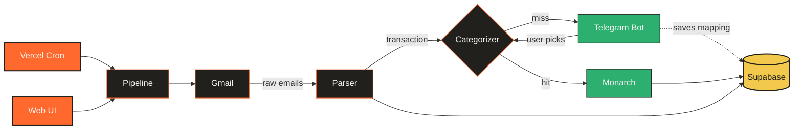

<!-- ═══════════════════════════════════════════════════════════════════ -->
<!--                    U P I   I N G E S T O R                        -->
<!-- ═══════════════════════════════════════════════════════════════════ -->

<div align="center">

<a href="#"></a>

<br/>

<p>
  <a href="https://nextjs.org"></a>
  <a href="https://react.dev"></a>
  <a href="https://www.typescriptlang.org/"></a>
  <a href="https://tailwindcss.com"></a>
</p>
<p>
  <a href="https://supabase.com"></a>
  <a href="https://developers.google.com/gmail/api"></a>
  <a href="https://core.telegram.org/bots/api"></a>
  <a href="https://vercel.com"></a>
</p>

</div>

---

## What it does

Your bank sends a notification email every time you make a UPI payment. UPI Ingestor reads those emails, pulls out the structured data — amount, merchant, timestamp, reference — and gives you a clean searchable dashboard, without any manual entry.

It works in three layers, each independently useful:

<table>
<tr>
<td width="33%" valign="top" align="center">

### Parse + track

Point it at a Gmail label, connect your bank email address, and every UPI transaction is automatically extracted, deduplicated, and stored. Works today with HDFC — parser registry is open for contributions.

</td>
<td width="33%" valign="top" align="center">

### Categorize + learn

Define rules (regex / contains / equals on merchant name) or just let it ask you. Telegram inline keyboards prompt for unknown merchants, and every answer is remembered as a permanent mapping — so each merchant is only categorized once.

</td>
<td width="33%" valign="top" align="center">

### Publish to Monarch

Connect [Monarch Money](https://monarch.com/referral/2zjygvbrc9) and categorized transactions are automatically pushed to your Monarch account via their GraphQL API — no CSV exports, no import steps, no manual matching.

</td>
</tr>
</table>

---

## Monarch Money

If you want automatic expense tracking and net worth alongside your UPI transactions, Monarch Money is the best tool for it. The Monarch publisher is built in and requires no extra configuration — just connect your account in the dashboard and transactions flow in automatically.

<table align="center">
<tr>
<td align="center" style="padding: 20px 32px;">

**[→ Try Monarch Money free](https://monarch.com/referral/2zjygvbrc9)**

<sub>Budgets, net worth, investment tracking, and transactions — in one place.<br/>Use the link above to get started.</sub>

</td>
</tr>
</table>

> If you don't use Monarch, the app is still fully useful as a parser and categorization dashboard. Transactions will accumulate with `pending` or `needs_review` status, which you can browse in the UI. Telegram prompts still work for learning category mappings.

---

## Architecture



> Detailed walkthrough → **[docs/architecture.html](docs/architecture.html)** &nbsp;·&nbsp; Service setup reference → **[docs/setup.html](docs/setup.html)**

---

## Quick setup

```bash
# 1. install
git clone <repo-url> && cd upi-ingestor && npm install

# 2. environment
cp .env.example .env.local
# fill in: Supabase URL + anon key, ENCRYPTION_KEY, CRON_SECRET,
#           Google OAuth credentials, Telegram bot token
# MONARCH_GRAPHQL_URL is pre-filled — no change needed

# 3. database — apply all migrations via the Supabase SQL editor
#    or: supabase db push   (requires supabase CLI linked to your project)

# 4. run
npm run dev
```

Full service-by-service setup (Google Cloud Console, Telegram BotFather, Supabase, Monarch, Vercel deployment) → **[docs/setup.html](docs/setup.html)**

<div align="center">
<a href="#"></a>
</div>
